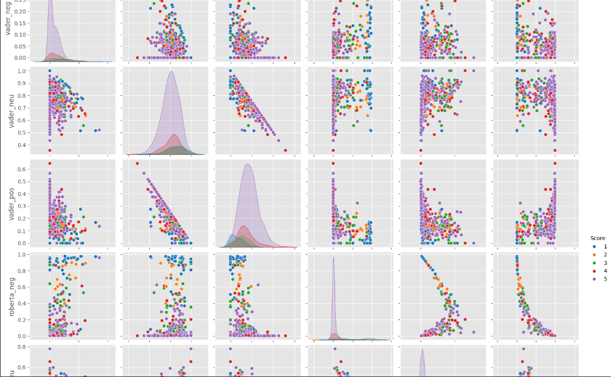
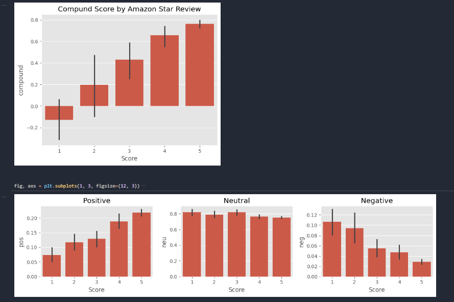

# Análise dos Dados IMDB e Reviews da Amazon

Este projeto realiza análises de dados de avaliações de filmes do IMDB e de produtos da Amazon.

## Descrição
O objetivo é aplicar técnicas de processamento de linguagem natural (NLP) para analisar sentimentos e realizar classificações a partir dos dados de avaliações. Diferentes modelos são testados e visualizados com a ajuda da biblioteca Seaborn.

## Estrutura do Projeto
- `files/`: Contém os arquivos de dados CSV com as avaliações. (https://www.kaggle.com/datasets/snap/amazon-fine-food-reviews)
- `images/`: Imagens geradas durante a análise (visualizações em Seaborn, etc).

## Visualizações
Aqui estão algumas visualizações dos modelos treinados com a biblioteca Seaborn:




## Ferramentas e Bibliotecas Usadas
- Python
- Pandas
- NLTK
- Scikit-learn
- Seaborn
- Matplotlib

## Como Usar
1. Clone este repositório:
   ```bash
   git clone https://github.com/PortoDaniel/nlp.git
